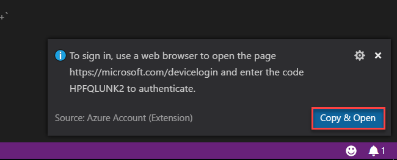

## Microservice with Azure Functions and Cosmos DB ##

In this hands-on-lab you will learn basics of how to implement microservice with Azure Function and Cosmos DB. 

**Pre-requisites to being with this lab**

1. Visual Studio Code 
2. Azure Function CLI 
3. Active Azure Subscription 
4. Storage Explorer 

###Basic Setup 1 : Setting up Visual Studio Code Extension###

**Please install these three extensions in Visual Studio Code before starting the session.**

1. Azure Functions 
2. Azure Cosmos DB 
3. Azure App Service 

You can run following command to install the extension in Visual Studio Code 

`code --install-extension ms-azuretools.vscode-azureappservice`

`code --install-extension ms-azuretools.vscode-cosmosdb`

`code --install-extension ms-azuretools.vscode-azurefunctions`

After installing the extensions, please restart your Visual Studio Code and check extensions tab to see if it is showed as below or not. 

###Basic Setup 2 : Install into Azure Account ###

> Make sure you have an active subscription that you activated from the Azure Pass organizer has provided you. 

**Step 1:** Press **Ctrl + Shift + P** to open command palette 

**Step 2:** Type **Azure: Sign In** and click on **Azure: Sign In**

**Step 3:** You will see a pop-up on right bottom section, click on **Copy and Open**

**Step 4:** In the browser, paste the code that is in your clipboard and click on **Continue**

**Step 5:** You will be prompted to login with your Microsoft account that has Azure Subscription. Sign in with your account, then you will see following screen. You can close this screen and move forward. 

**Step 6:** To verify your login, press **Ctrl + Shift + P**, type and click **Azure:Select Subscriptions**

**Step 7:** After clicking **Azure: Select Subscriptions**, if you can see list of your subscriptions then, your login has worked. 

###Azure Function Setup: Movie Engine###

**Step 1:** Login to Azure Portal [https://portal.azure.com](https://portal.azure.com "https://portal.azure.com")

**Step 2:** Click on **Create a resource** on left top position of left side bar

**Step 3:** Click on **Compute** and then **Function App**

**Step 4:** Enter the following details in the new blade and click **Create**
	
- **App Name:** Name of your application. This needs to be globally unique. This will be the URL for your application 
- **Subscription:** Select the subscription you have 
- **Resource Group:** Since this is the first deployment of our system, select **Create new**
- **OS:** Use **Windows** as your OS
- **Hosting Plan:** Select **Consumption Plan**
- **Location:** Choose a data center of your choice. ***(Southeast Asia is the nearest datacenter from Nepal so it will be the best choice to avoid latency)***
- **Storage:** Select **Create new**
- **Application Insights:** Select **Off**

**When you receive deployment completed message, open the URL in browser to see if your Azure Function App is running or not.**

###Azure Function Setup: Ticket Engine###

**Step 1:** Click on **Create a resource** on left top position of left side bar

**Step 2:** Click on **Compute** and then **Function App**

**Step 3:** Enter the following details in the new blade and click **Create**
	
- **App Name:** Name of your application. This needs to be globally unique. This will be the URL for your application 
- **Subscription:** Select the subscription you have 
- **Resource Group:** Since this is your second deployment of our system, select **Use Existing** and in drop down select the resource group you created earlier. 
- **OS:** Use **Windows** as your OS
- **Hosting Plan:** Select **Consumption Plan**
- **Location:** Choose a data center of your choice. ***(Southeast Asia is the nearest datacenter from Nepal so it will be the best choice to avoid latency)***
- **Storage:** Select **Create new**
- **Application Insights:** Select **Off**

**When you receive deployment completed message, open the URL in browser to see if your Azure Function App is running or not.**

###Azure Function Setup: Billing Engine###

**Step 1:** Click on **Create a resource** on left top position of left side bar

**Step 2:** Click on **Compute** and then **Function App**

**Step 3:** Enter the following details in the new blade and click **Create**
	
- **App Name:** Name of your application. This needs to be globally unique. This will be the URL for your application 
- **Subscription:** Select the subscription you have 
- **Resource Group:** Since this is your second deployment of our system, select **Use Existing** and in drop down select the resource group you created earlier. 
- **OS:** Use **Windows** as your OS
- **Hosting Plan:** Select **Consumption Plan**
- **Location:** Choose a data center of your choice. ***(Southeast Asia is the nearest datacenter from Nepal so it will be the best choice to avoid latency)***
- **Storage:** Select **Create new**
- **Application Insights:** Select **Off**

**When you receive deployment completed message, open the URL in browser to see if your Azure Function App is running or not.**

###Creating App Service for frontend application###

**Step 1:** Click on **Create a resource** on left top position of left side bar

**Step 2:** Click on **Web + Mobile ** and then **Web App**

**Step 3:** Enter the following details in the new blade 
	
- **App Name:** Name of your app service. This needs to be globally unique 
- **Subscription:** Select the subscription you have 
- **Resource Group:** Since this is your second deployment of our system, select **Use Existing** and in drop down select the resource group you created earlier. 
- **OS:** Choose **Windows**
- **Application Insight:** Select **Off**
  

**Step 4**: Select **App Service Plan/Location** and follow following steps 

- Click on **Create new**
- Enter name of your **App Service Plan**
- Select **Location** (Southeast Asia recommended)
- Click on **Pricing Tier**
- Select a **Pricing Tier** (B1 Basic recommended)
- Click **Select**
- Click **Ok**

**Step 5**: Click **Create**

**Open the URL after deployment has been completed, you will see the following screen**

###Creating Cosmos DB Account###

**Step 1:** Click on **Create a resource** on left top position of left side bar

**Step 2:** Click on **Databases** and then **Azure Cosmos DB**

**Step 3:** Enter the following details in the new blade and click **Create**
	
- **ID:** Name of your Cosmos DB account. This needs to be globally unique 
- **API:** Select **SQL** as API
- **Subscription:** Select the subscription you have 
- **Resource Group:** Since this is your second deployment of our system, select **Use Existing** and in drop down select the resource group you created earlier. 
- **Location:** Choose a data center of your choice. ***(Southeast Asia is the nearest datacenter from Nepal so it will be the best choice to avoid latency)***
- **Enable geo-redundancy:** Untick it. 

###Creating Cosmos DB Database : Movie Database ###

**Step 1:** After Cosmos DB account has been created, open your Cosmos DB account by clicking on **All Services **, searching for **Cosmos DB** and selecting the account you created in early step 

**Step 2:** Click on **Overview** then **Add Collection**

**Step 3:** You will be redirected to **Data Explorer** tab then do the following 

- **Database id:** Select **Create new** enter **MovieDatabase**
- **Collection id:** Enter **UpcomingShows**
- **Storage capacity:** Select **Fixed(10 GB)**
- **Throughput:** Enter **400**
- Click **Ok**

###Creating Cosmos DB Database : Ticket Database ###

**Step 1:** After **MovieDatabase** has been deployed, click on **New collection**

**Step 2:** On **Add Collection** tab do the following 

- **Database id:** Select **Create new** and enter **TicketDatabase**
- **Collection id:** Enter **TicketOrders**
- **Storage capacity:** Select **Fixed(10 GB)**
- **Throughput:** Enter **400**
- Click **Ok**

###Deploying Ticket Engine using Visual Studio Code ###

**Step 1:** Extract the zip folder provided at the workshop 

**Step 2:** Open **Visual Studio Code**, click **Open folder** and select **TicketEngine** root folder

**Step 3:** Expand **Azure Function** section and click on **Deploy to function** icon 

**Step 4:** On **Select the folder to zip and deploy** select current folder 

**Step 5:** On **Select a Subscription** select your subscription

**Step 6:** On **Select a Function App** select your function application

**Step 7:** If the following menu pops up, click on **Select Runtime** and click **beta (Preview)**

**Step 8:** Click on deploy 

**Step 8:** After deployment is completed, you will see this screen which means your deployment is completed. 

**Repeat the same procedure for MovieEngine, BillingEngine**

###Deploying Book My Show Web App using Visual Studio Code ###

**Step 1:** Open **Visual Studio Code**, click **Open folder** and select **BookMyShow** root folder

**Step 2:** Open **config.js** and change URL of **MovieEngine** and **TicketEngine** to what you created in early exercise. 

**Step 3:** Expand **Azure App Service** section and click on **Deploy to web** icon 

**Step 4:** On **Select the folder to zip and deploy** select current folder 

**Step 5:** On **Select a Subscription** select your subscription

**Step 6:** On **Select a Web App** select your web application

**Step 7:** Click on **Deploy**

###Configurations to change ###

####BillingEngine####

`emailAddress` : `email@rvimandal.com`

`emailPassword` : `Nep@l@123`

####MoviesEngine####

`CosmosDBHost` : Host of CosmosDB account you created

`CosmosDBAuthKey` : Primary key of CosmosDB account

`DatabaseId` : `MovieDatabase`

`CollectionId` : `UpcomingShows`

####TicketEngine####

`CosmosDBHost` : Host of CosmosDB account you created

`CosmosDBAuthKey` : Primary key of CosmosDB account

`DatabaseId` : `TicketDatabase`

`CollectionId` : `TicketOrders`

`MovieEngineUrl` : URL of Movies Engine Azure Function

`BillingEngine` : URL of Billing Engine Azure Function 

`EventGridTopicEndpoint` : `<empty>`

`EventGridTopicAuthKey` : `<empty>`

`EventTriggerType` : `HTTP`